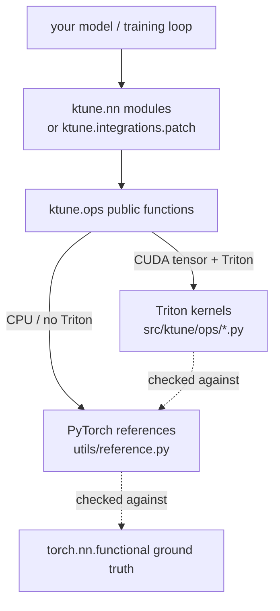

# LLM-tuning-kernel · `ktune`

**Learn how LLM fine-tuning gets fast and memory-cheap by building the GPU
kernels yourself.** A from-scratch, Triton-first reimplementation of the
techniques behind [Unsloth](https://github.com/unslothai/unsloth) and
[Liger-Kernel](https://github.com/linkedin/Liger-Kernel) — RMSNorm, RoPE, SwiGLU,
fused cross-entropy, Fused-Linear-Cross-Entropy, and FlashAttention — each paired
with a readable PyTorch reference, tests, benchmarks, and a concept doc.

[](https://github.com/aabhimittal/llm-tuning-kernel/actions/workflows/ci.yml)
[](https://colab.research.google.com/github/aabhimittal/llm-tuning-kernel/blob/claude/llm-kernel-tuning-repo-yba1co/examples/finetune_qlora.ipynb)
[](LICENSE)

---

## Why this repo exists

Most "fine-tune an LLM" tutorials treat the GPU as a black box. The actual
speed/memory wins of modern fine-tuning come from a handful of **custom GPU
kernels** that move less data through memory. This repo opens that box: you read
the math, read the kernel, run the test, measure the win, then apply it to a real
QLoRA fine-tune.

It's built to be a **solid conceptual on-ramp for someone new to GPU kernels** —
without hand-waving the state of the art.

### The one idea behind everything

On modern GPUs most LLM ops are **memory-bound**: limited by HBM bandwidth, not
math. Custom kernels win by (1) **fusing** memory-bound ops so intermediates never
hit HBM, and (2) **tiling + online algorithms** so tensors that are too big to
store (attention scores, LM-head logits) are never materialised at all. Full story
in [`docs/00-why-kernels.md`](docs/00-why-kernels.md).

## The kernels

| Kernel | Trick it teaches | Code | Doc |
|--------|------------------|------|-----|
| RMSNorm | row reduction, fused fwd+bwd | [`ops/rmsnorm.py`](src/ktune/ops/rmsnorm.py) | [02](docs/02-rmsnorm.md) |
| RoPE | element-wise rotation, adjoint backward | [`ops/rope.py`](src/ktune/ops/rope.py) | [03](docs/03-rope.md) |
| SwiGLU | activation fusion = saved bandwidth | [`ops/swiglu.py`](src/ktune/ops/swiglu.py) | [04](docs/04-swiglu.md) |
| Cross-Entropy | **online softmax**, gradient-in-place | [`ops/cross_entropy.py`](src/ktune/ops/cross_entropy.py) | [05](docs/05-cross-entropy.md) |
| **Fused-Linear-CE** | **chunking** away the 128k-vocab logits (>4× mem) | [`ops/fused_linear_ce.py`](src/ktune/ops/fused_linear_ce.py) | [06](docs/06-fused-linear-ce.md) |
| **FlashAttention** | **tiling + 2-D online softmax** | [`ops/flash_attention.py`](src/ktune/ops/flash_attention.py) | [07](docs/07-flash-attention.md) |

Every op exists **twice** — a pure-PyTorch reference (the readable math, runs on
CPU, the correctness oracle) in [`utils/reference.py`](src/ktune/utils/reference.py)
and a hand-written Triton kernel. The public function dispatches to Triton on CUDA
and the reference on CPU, so **the whole library runs and is testable without a
GPU**; you just don't get the speedup.

## Architecture



## Quick start

```bash
git clone https://github.com/aabhimittal/llm-tuning-kernel.git
cd llm-tuning-kernel
pip install -e ".[dev]"            # CPU: references + tests
# pip install -e ".[gpu]"          # GPU: torch + triton to run the kernels
# pip install -e ".[app]"          # transformers/peft/bitsandbytes for the QLoRA example
```

```python
import torch
from ktune.ops import rms_norm, swiglu, flash_attention, fused_linear_cross_entropy

# Runs the Triton kernel on CUDA, the reference on CPU — same call either way.
x = torch.randn(4, 1024, 2048)
w = torch.ones(2048)
y = rms_norm(x, w)
```

Apply to a real model (see [`docs/08`](docs/08-applying-to-models.md)):

```python
from transformers import AutoModelForCausalLM
from ktune.integrations import apply_ktune_to_model

model = AutoModelForCausalLM.from_pretrained(
    "Qwen/Qwen2.5-0.5B", attn_implementation="flash_attention_2")
apply_ktune_to_model(model)        # swaps RMSNorm + SwiGLU-MLP for fused kernels
```

## Suggested learning path

1. [00 · Why kernels](docs/00-why-kernels.md) — the GPU memory wall.
2. [01 · Triton 101](docs/01-triton-101.md) — the programming model.
3. [02 RMSNorm](docs/02-rmsnorm.md) → [03 RoPE](docs/03-rope.md) →
   [04 SwiGLU](docs/04-swiglu.md) — fusion basics; read each doc next to its two
   implementations.
4. [05 Cross-entropy](docs/05-cross-entropy.md) — the online softmax.
5. [06 Fused-Linear-CE](docs/06-fused-linear-ce.md) — the flagship memory win.
6. [07 FlashAttention](docs/07-flash-attention.md) — it all comes together.
7. [08 Applying to models](docs/08-applying-to-models.md) — the QLoRA capstone.

Each doc ends with **exercises** (the FlashAttention backward is the capstone).

## Testing

```bash
pytest -m "not gpu"      # CPU reference tests — run anywhere, this is what CI runs
pytest -m gpu            # Triton-kernel-vs-reference tests — need a CUDA GPU
```

GPU-less CI lints, imports, and runs the CPU reference suite; the kernel tests are
collected but skipped without CUDA. Run them (and the benchmarks) on a free Colab
T4 via the badge above.

## Benchmarks

Speed + peak-memory harness for T4 and A100 configs:

```bash
python benchmarks/bench_ops.py --hardware t4
python benchmarks/bench_flce.py --hardware t4      # the memory showcase
python benchmarks/bench_attention.py --hardware t4 --seq 4096
```

Expected wins and how to reproduce: [`benchmarks/RESULTS.md`](benchmarks/RESULTS.md).

## Status & honesty

- All kernels ship with fwd+bwd **except FlashAttention**, whose backward
  currently recomputes via autograd (correct but not yet memory-optimal). Fusing
  it in Triton is the capstone exercise in [doc 07](docs/07-flash-attention.md).
- The CPU reference suite is verified green; the Triton kernels must be verified on
  a GPU (the Colab notebook does this in one cell).

## Credits

This is an educational reimplementation standing on the shoulders of:
[Liger-Kernel](https://github.com/linkedin/Liger-Kernel)
([paper](https://arxiv.org/abs/2410.10989)),
[Unsloth](https://github.com/unslothai/unsloth),
[FlashAttention](https://github.com/Dao-AILab/flash-attention), and the
[Triton](https://github.com/triton-lang/triton) project. All code here is written
fresh for clarity; see each doc for the ideas it borrows. Licensed under
[Apache-2.0](LICENSE).
